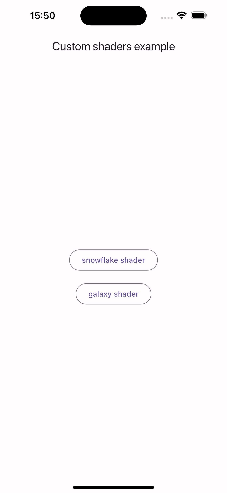
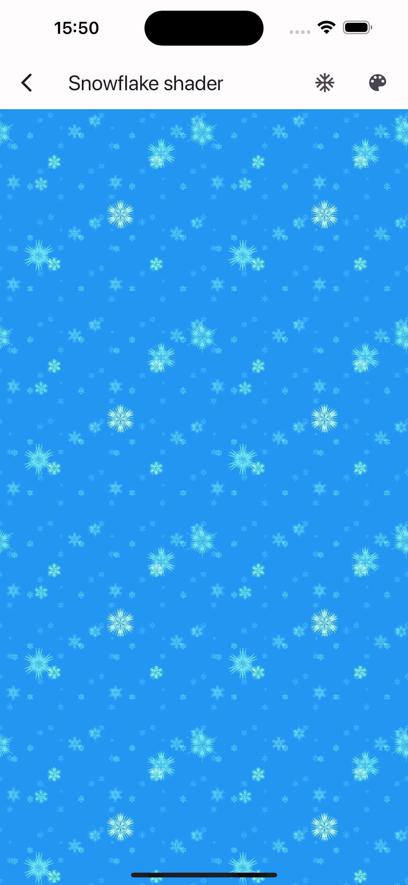
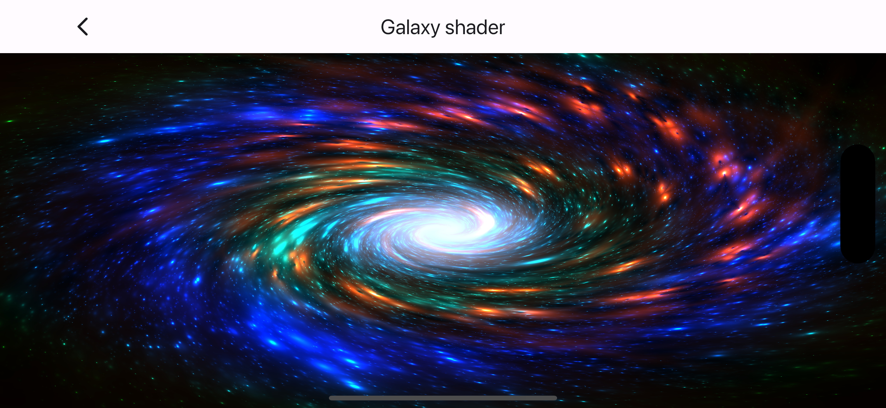

# Flutter Custom Shaders Examples

|                                   |                                   |
|-----------------------------------|-----------------------------------|
|  |  |





## Description

This repository showcases examples of how to integrate and use custom shaders in Flutter applications. Shaders can be used to create advanced visual effects, such as complex animations, gradient effects, and other graphical enhancements, all rendered smoothly and efficiently.

## Features

- **Custom Shader Integration**: Learn how to write and apply custom shaders in Flutter.
- **Interactive Examples**: Each example is designed to be easy to understand and modify, making it perfect for learning and experimentation.
- **Visual Demonstrations**: See the shaders in action with provided screenshots and descriptions.

## Getting Started

To get started with the examples, clone the repository and navigate to the project directory:

```bash
git clone https://github.com/Vabiel/flutter-custom-shaders.git
cd flutter-custom-shaders
